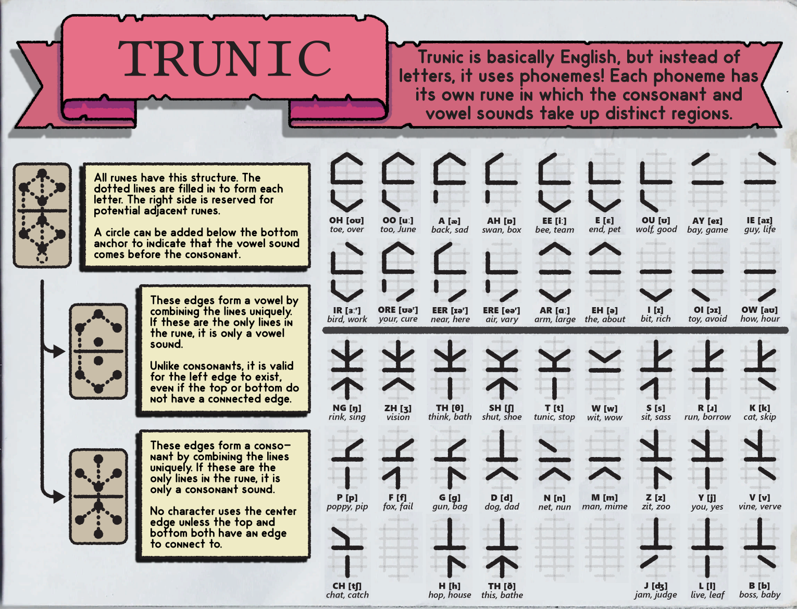
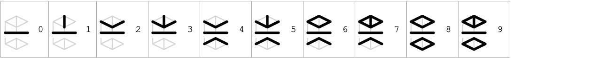

# Trunic Glyph Generator

A Streamlit web app that converts English text into Trunic, a writing system from the game _TUNIC_, using phonetic transcription.

<a href="https://trunic-glyph-generator.streamlit.app/" target="_blank">Link to Web App</a>


## About

This simple web app takes English text, converts it into phonetic form, and maps the sounds to Trunic - a writing system from the game _TUNIC_. The phonetics are all derived from American English pronunciation, similar to the text found in the in-game manual.

The following diagram explains the system in detail.

_credit: https://tunic.wiki/books/secrets/page/trunic_

Optionally, you can also convert digits into a custom set of glyphs. Otherwise, digits will show up as standard arabic numerals.

_credit: https://github.com/dirdam_

There is also an option for preventing chains of inverted glyphs in words such as "anemone" or "biohazard" - this may make them easier to read. It works by rendering all vowel-consonant-vowel sequences as `(vowel)-(consontant-vowel)` instead of `(vowel-consonant)-(vowel)`, where the parentheses denote a syllable represented by a single glyph.

Lastly, feel free to run the jupyter notebook locally if you wish to modify or extend any of the code.

## Bug Reports / Feedback

If you encounter a bug or incorrect transcription, please open an issue on this repository.

Helpful information to include:

- The text you entered
- What you expected to happen
- What actually happened
- Screenshot (if relevant)
- Browser / device

## Local Development

You may wish to clone and run the web app locally:

```bash
pip install -r requirements.txt
streamlit run src/app.py
```

Please note that the project has a dependency on the open-source `espeak-ng` software, the installation of which will vary depending on your platform.

### Font

There are two fonts generated in this project (under the `fonts/` folder) that are used in the output box of the web app to render the Trunic glyphs correctly. These are `Trunic-Regular.ttf` and `Trunic-Strikethrough.ttf`, the only difference being the strikethrough in the latter which is more in line with the in-game text.

If you wish to copy and paste the web app output, please note that the glyphs will only be rendered correctly using either of these two fonts. To install them, simply download the .ttf file, right click, and click "Install". They can then be used in any text-editing software.

## Credits

Uses Streamlit, phonemizer, fontParts, ufo2ft, and eSpeak NG.

Inspired by the writing system in TUNIC by Isometricorp Games.
Unofficial fan project.

Credit to dirdam on Github for designing the numbered glyphs.

## License

MIT License © 2026 Ricardo Cortes-Monroy
